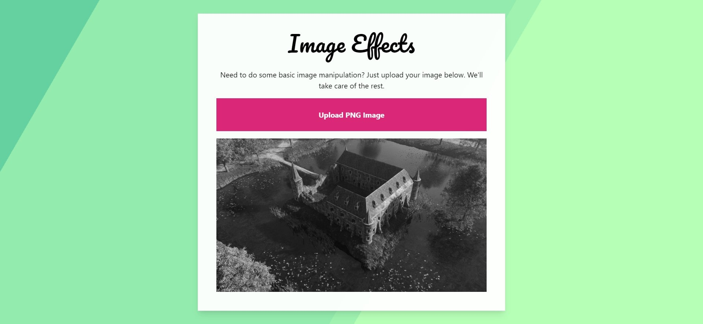

# Image processing with Web Assembly

## Goal
Took a quick course on [Zero To Mastery](https://zerotomastery.io/courses/learn-webassembly/) to learn the basics of Web Assembly. As a bonus, we get to learn the basics of the Rust language. Try out the app using the link in About section.

## App description
A user uploads a PNG image. The app converts the image to grayscale and renders the converted version in the browser.

The workflow is the following:
- Upload a PNG file using HTML inputs
- Read file using JS
- Convert image to Base64 string to pass on to Rust
- Transform string to binary file in Rust
- Manipulate image
- Use buffer to store image
- Encode image to Base64 string
- Pass Base64 string back to JS to render the manipulated image in the browser

## Tech
- Webpack: bundling, compiling Rust, creating dev server
- HTML/JS/CSS: UI
- Rust (compiles to Web Assembly): CPU intensive operations (ie: transform an image)
